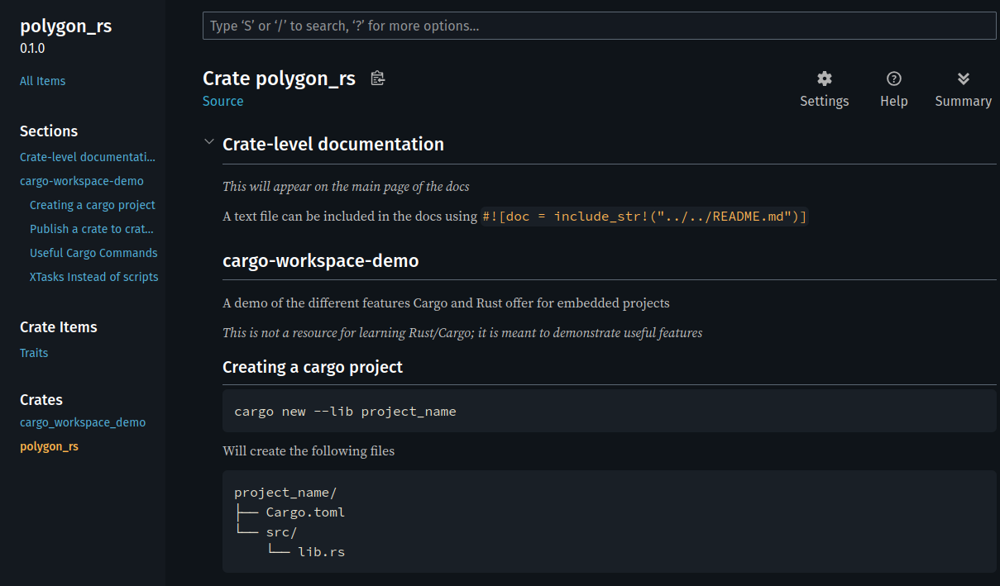

# cargo-workspace-demo

A demo of the different features Cargo and Rust offer for embedded projects.
_This is not a resource for learning Rust/Cargo; it is meant to demonstrate useful features_

## Creating a cargo project

```bash
cargo new --lib project_name
```

Will create the following files

```pgsql
project_name/
├── Cargo.toml
└── src/
    └── lib.rs
```

## Publish a crate to crates.io

[Rust-lang publishing guide](https://doc.rust-lang.org/cargo/reference/publishing.html)

### Login to crates.io

You only need to do this once:

1. Go to [crates.io](https://crates.io/) and log in with your GitHub account.
2. Navigate to Account Settings > API Tokens.
3. Generate a new token. You can leave the scopes as default.
4. Run `cargo login` and paste the token when prompted:

```bash
cargo login
# Paste your API token here and press Enter
```

### Dry Run (Recommended to test things)

Before you publish for real, perform a dry run. This checks for any packaging errors without actually uploading the crate.

```bash
cargo publish --dry-run
```

Cargo will verify your `Cargo.toml` metadata and package your files, reporting any warnings or errors it finds.

### Publish for Real

If the dry run was successful, you're ready to publish.

```bash
cargo publish
```

Your crate will be compiled, packaged and uploaded to crates.io. It might take a few minutes for the crate to be
indexed and for documentation to appear on [docs.rs](https://docs.rs/).

To update publish a new version update the `version` value in the `Cargo.toml`. Make sure to follow the
[SemVer Rules](https://doc.rust-lang.org/cargo/reference/semver.html).

## Cargo Generate

[Cargo Generate Book](https://cargo-generate.github.io/cargo-generate/index.html)

This is a minimal template for building a cargo project with variable hal dependency.

### 1. Template setup

```pgsql
demo-template/
├── cargo-generate.toml
├── Cargo.toml
├── .cargo/config.toml
└── README.md
```

### 2. Create a cargo-generate.toml

```toml
[template]
description = "A Cargo workspace for embedded targets"

[placeholders.hal_crate] 
type = "string"
prompt = "Select a HAL"
choices = ["stm32f4xx-hal", "imxrt-hal", "rp2040-hal"]
default = "stm32f4xx-hal"

[hooks]
post = "add_hal.rhai"
```

### 3. Implement a post-script to add the hal

```rhai
let hal = values.hal_crate;

print("Adding HAL crate: " + hal);
let result = system::command("cargo", ["add", hal]);

print(result);
```

### 4. In the workspace manifest

```toml
[package]
name = "{{project-name}}"
version = "0.1.0"
edition = "2024"
authors = [ "{{authors}}" ]
```

### 5. Implementation with generic HAL selection
Create a file `src/main.rs.liquid`
```txt
use {{hal_crate}} as hal;

#[entry]
fn main() {
    // Setup peripherals, clocks, etc. using hal
}
```

### 6. Generate a workspace

````bash
cargo generate \
  git@github.com/mitchelldscott/cargo-workspace-demo \
  templates/demo-template \
  -d hal_crate=imxrt-hal \
  --name hal-demo
````

```bash
$ cd hal-demo
$ cat src/main.rs 
#![no-std]
#![no-main]

use imxrt-hal as hal;

#[unsafe(no_mangle)]
pub extern "C" fn _start() -> ! {
    
}
$ cat Cargo.toml 
[package]
name = "hal-demo"
version = "0.1.0"
edition = "2024"
authors = [ "user name <user email>" ]
```

## Useful Cargo Commands

[Cargo Commands](https://doc.rust-lang.org/cargo/commands/build-commands.html)

### Testing

[Rust-lang: Automated Tests](https://doc.rust-lang.org/book/ch11-00-testing.html)
[Rust-lang: Cargo test](https://doc.rust-lang.org/cargo/reference/cargo-targets.html#tests)

Cargo provides multiple ways to test code: unit, integration and doc tests.

Run all functions marked with `#[test]` in the crate:

```bash
cd shape-rs
cargo test
```

```text
   Compiling shape-rs v0.1.0 (~/cargo-workspace-demo/shape-rs)
    Finished `test` profile [unoptimized + debuginfo] target(s) in 0.16s
     Running unittests src/lib.rs (~/cargo-workspace-demo/target/debug/deps/shape_rs-583931035fc61bbb)

running 1 test
test ngon_test::ccw_vs_cw ... ok

test result: ok. 1 passed; 0 failed; 0 ignored; 0 measured; 0 filtered out; finished in 0.00s

   Doc-tests shape_rs

running 1 test
test shape-rs/src/lib.rs - Vertex (line 11) ... ok

test result: ok. 1 passed; 0 failed; 0 ignored; 0 measured; 0 filtered out; finished in 0.00s
```

Or run individual tests

```bash
cd shape-rs
cargo test --doc
```

```text
Compiling shape-rs v0.1.0 (~/cargo-workspace-demo/shape-rs)
Finished `test` profile [unoptimized + debuginfo] target(s) in 0.03s
Doc-tests shape_rs

running 1 test
test shape-rs/src/lib.rs - Vertex (line 11) ... ok

test result: ok. 1 passed; 0 failed; 0 ignored; 0 measured; 0 filtered out; finished in 0.00s
```

```bash
cd shape-rs
cargo test ngon_test
```

```text
   Compiling shape-rs v0.1.0 (~/cargo-workspace-demo/shape-rs)
    Finished `test` profile [unoptimized + debuginfo] target(s) in 0.15s
     Running unittests src/lib.rs (~/cargo-workspace-demo/target/debug/deps/shape_rs-583931035fc61bbb)

running 1 test
test ngon_test::ccw_vs_cw ... ok

test result: ok. 1 passed; 0 failed; 0 ignored; 0 measured; 0 filtered out; finished in 0.00s
```

### Build Documentation

Build the docs and open in the default browser:

```bash
cd shape-rs
cargo doc --open
```



### Format Code

[`rustfmt` github repo](https://github.com/rust-lang/rustfmt)

Format all source code:

```bash
cargo fmt
```

Check if the code is formatted properly:

```bash
cargo fmt -- --check
```

### Build and Run Code

Run the current package:

```bash
cargo run
```

Run an Example:

```bash
cargo run -p shape-rs --example shapes
```

```text
   Compiling shape-rs v0.1.0 (~/cargo-workspace-demo/shape-rs)
    Finished `dev` profile [unoptimized + debuginfo] target(s) in 0.13s
     Running `~/cargo-workspace-demo/target/debug/examples/shapes`
```

### Configure Cargo

[Cargo Configuration](https://doc.rust-lang.org/cargo/reference/config.html) allows setting aliases for cargo.

Add this to `.cargo/config.toml`:

```toml
[alias]
shapes = "run -p shape-rs --example shapes"
pr = "run -p shape-rs --example shapes --release"
ptest = "test -p shape-rs ngon"
```

```bash
cargo shapes
```

```text
   Compiling shape-rs v0.1.0 (~/cargo-workspace-demo/shape-rs)
    Finished `dev` profile [unoptimized + debuginfo] target(s) in 0.14s
     Running `~/cargo-workspace-demo/target/debug/examples/shapes`
```

## XTasks Instead of scripts
